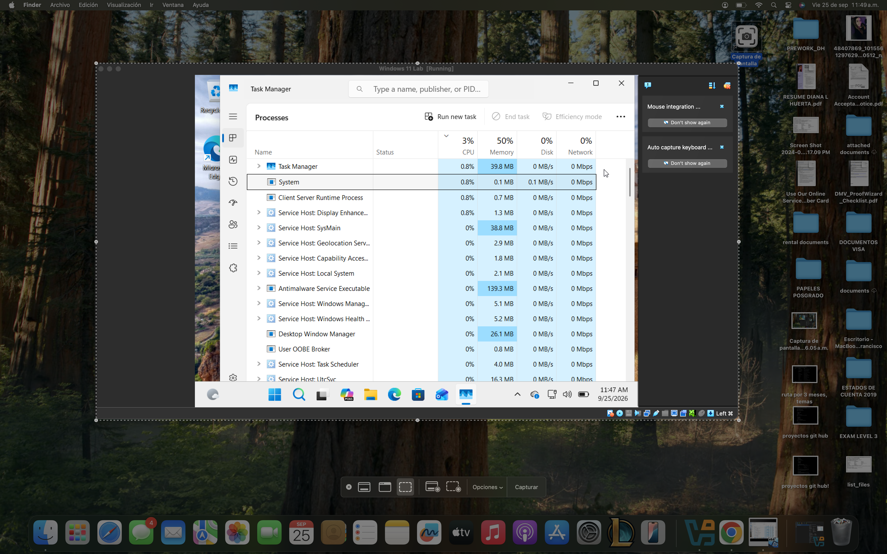
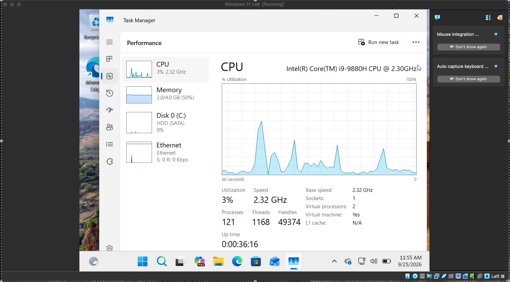

# LAB-001: Windows Performance Troubleshooting

## 1. Overview

**Category:** Help Desk / Windows Troubleshooting

**Environment:** Windows 11 Virtual Machine

**Virtualization Software:** VirtualBox

**Tool:** Task Manager

**Lab Status:** Completed

---

## 2. System Environment

### Virtual Machine Configuration

| Component | Configuration |
|---|---|
| Operating System | Windows 11 |
| Virtualization Software | VirtualBox |
| Virtual Processors | 2 |
| Assigned RAM | 4 GB |
| CPU Model Displayed | Intel Core i9-9880H @ 2.30 GHz |
| Disk Type | HDD (SATA) |

### Current Performance Snapshot

| Metric | Observed Value |
|---|---|
| CPU Usage | 3% |
| CPU Speed | 2.32 GHz |
| Memory Usage | 2.0 / 4.0 GB (50%) |
| Disk Activity | 0% |
| Network Activity | 0 Kbps |
| Processes | 121 |
| Threads | 1,168 |
| Handles | 49,374 |

**Observation:** The virtual machine was functioning normally during this snapshot.

---

## 3. Objective

Investigate a report of slow computer performance by monitoring CPU, memory, disk, and network usage.

The goal is to understand how system resources behave and determine whether a performance issue can be reproduced.

---

## 4. Scenario

A user reports that their computer is running slowly.

As a Service Desk Analyst, I need to investigate system resource usage, observe performance over time, and document my findings before making any changes.

---

## 5. Tools Used

- Windows 11
- Task Manager
- VirtualBox

---

## 6. Troubleshooting Steps

1. Opened Task Manager using Ctrl + Shift + Esc.
2. Reviewed CPU, Memory, Disk, and Network usage.
3. Sorted processes by CPU usage.
4. Reviewed memory consumption.
5. Observed resource usage over time.
6. Compared measurements from two different sessions.
7. Recorded the findings.
8. Captured screenshots of Task Manager for documentation.

---

## 7. Findings

### Previous Observation — September 24, 2026

The following values were recorded during the previous lab session.

| Resource | Usage |
|---|---|
| CPU | 89% |
| Memory | 75% |
| Disk | 35% |

During the previous session, CPU usage later decreased to 8% without major changes.

**Note:** These values were recorded during the previous session. No screenshot is available for this observation.

### Current Observation — September 25, 2026

The following values were observed during the current session.

| Resource | Usage |
|---|---|
| CPU | 3% |
| Memory | 50% |
| Disk | 0% |
| Network | 0% |

**Assigned RAM:** 4 GB

### Observations

- CPU usage decreased from 89% during the previous session to 3% in the current observation.
- CPU usage had previously decreased to 8% during the earlier session.
- Memory usage was 75% during the previous session and 50% during the current observation.
- Disk activity was 35% during the previous session and 0% during the current observation.
- Network activity was 0% during the current observation.
- The virtual machine was functioning normally during the current observation.

---

## 8. Analysis

During the previous session, CPU usage reached 89% and later decreased to 8%.

During the current session, CPU usage was 3%, memory usage was 50%, and disk and network activity were both at 0%.

These observations suggest that the high CPU usage was temporary.

Memory usage also decreased between the two observations.

However, the exact cause of the initial high CPU usage was not identified.

The current measurements do not show sustained high resource usage. Further monitoring would be necessary if the user continued to experience slow performance.

---

## 9. Resolution

No system changes were made because a persistent performance issue was not reproduced during the current observation.

The system was functioning normally at the time of the latest observation.

---

## 10. Conclusion

This lab demonstrated how to monitor Windows system resources using Task Manager.

By comparing observations from two different sessions, I learned that CPU, memory, and disk usage can fluctuate over time.

A persistent performance issue was not confirmed, and the root cause was not identified.

---

## 11. Lessons Learned

- CPU usage can fluctuate during normal system activity.
- Resource percentages must be interpreted in context.
- High resource usage alone does not establish a hardware failure.
- Comparing observations over time helps identify changes in system performance.
- Troubleshooting requires gathering evidence before making changes.
- Accurate documentation should distinguish recorded measurements from screenshot evidence.

---

## 12. Evidence

### Screenshot 1 — Task Manager Processes

This screenshot shows the Processes tab in Windows Task Manager, including CPU, Memory, Disk, and Network usage.

### Screenshot 2 — Task Manager Performance

This screenshot shows the Performance tab in Windows Task Manager, including CPU performance, memory usage, disk activity, and network activity.

### Previous Session

No screenshot is available for the observations recorded on September 24, 2026.
